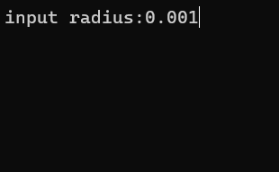
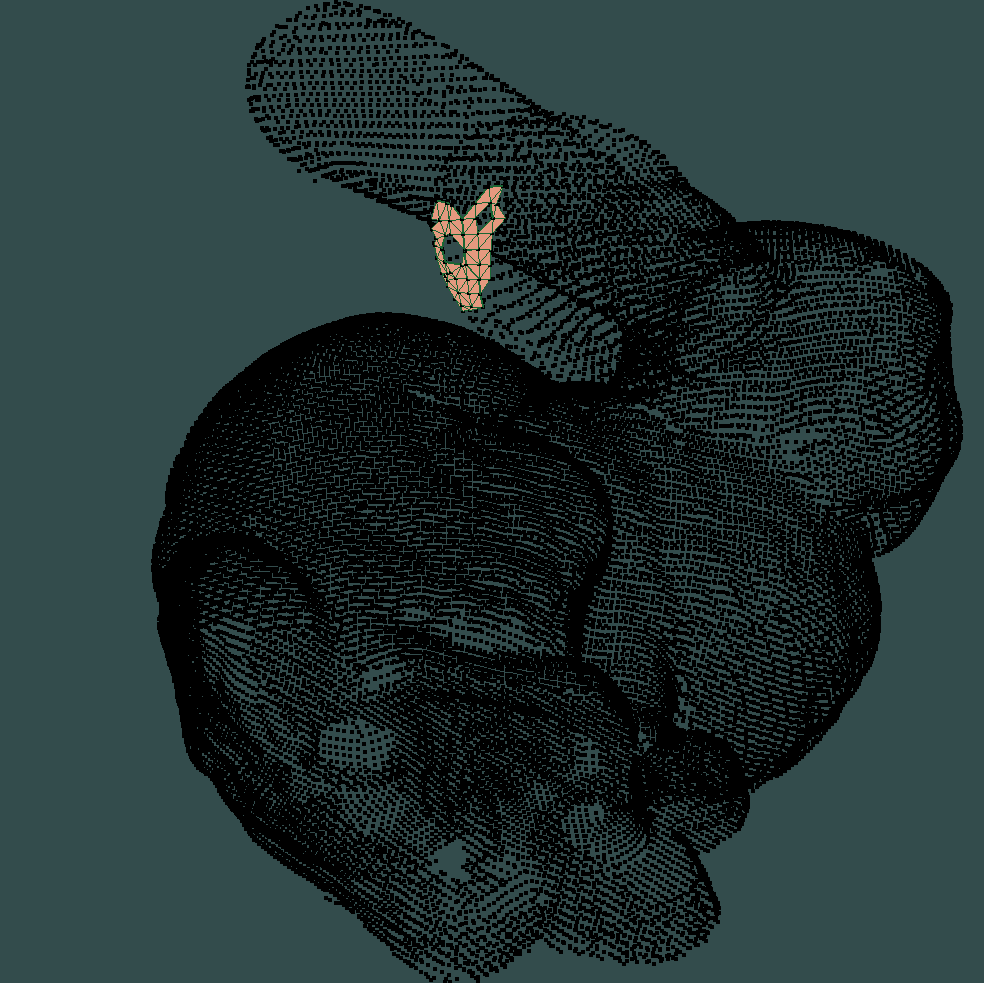

#  A visual demonstration of Ball Pivoting Algorithm

This project is a visualization of BPA, it is written based on learnopenGL's examples and [an exemplary C++ implementation of the ball pivoting algorithm](https://github.com/bernhardmgruber/bpa) for creating triangle meshes from point clouds.







## Main Features

* read in ply files (must include point normals)
* do BPA and reconstruct surfaces
* render the reconstruction process and result


## Build

CMakeLists.txt file is provided.
CMakeLists.txt is the default building way which uses libglad.a and libglfw3.a. This way might fail when not using windows 11 and minGW64.
CMakeLists_with_glad_glfw.txt is another building way, which build glad and glfw at the same time. This will create a much bigger folder and is avaliable under any platform(I hope so).
Here is an example of building the exe:

For windows 11 with mingw64 compiler and cmake:

under project folder,
```
mkdir build
cd build
cmake -G "MinGW Makefiles" ..
cmake --build .
```
noticing that the exe file should be put in this way:
```
BPA_visual
  ├─build
  │  BPA_visual.exe
  ├─input
  │  └─xxx
  ├─output
  │  └─xxx
  ├─xxx
  │  └─xxx
```

## parameter setting

The radius of the ball under bunny model should be around 0.001 - 0.005. Too small will make the result empty and cause segmentation fault. Too big will make the program low efficient and won't terminate. I recommend r = 0.001.


## Control

* rotation: move mouse
* change fov: mouse wheel

* forward/left/backward/right: w/a/s/d
* increase reconstruction speed: space

## Reference

[https://learnopengl.com/](https://learnopengl.com/)

[https://github.com/bernhardmgruber/bpa](https://github.com/bernhardmgruber/bpa)


